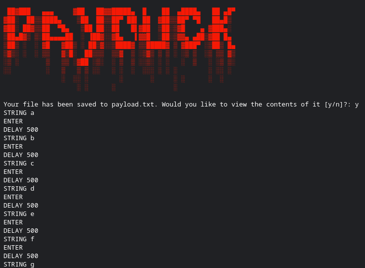

# PayDuck
### A python program converting a wordlist into a duckyscript payload
#### The maker of this tool does not take liability. Please only use this in ethical situations.

Usage:

This program uses command-line arguments, so if you run ```python3 paycreate.py -h```, the output is this:
```
usage: paycreate.py [-h] [-b BREAK_TIME] wordlist payload

A program to create rubber ducky scripts

positional arguments:
  wordlist              The wordlist file [i.e. ~/Wordlists/Wordlist.txt]
  payload               The file you want the payload to be saved as [i.e. ~/Payloads/Payload.txt]

optional arguments:
  -h, --help            show this help message and exit
  -b BREAK_TIME, --break_time BREAK_TIME
                        The seconds in between typing the words
```

This means it has two needed arguments, ```wordlist```, which is where the wordlist which will be used in the payload is stored, and ```payload```, which is where the new payload will be stored.

It also has one optional argument, which is ```--break_time```. This will specify how long the payload will wait for after typing a word in milliseconds, and the automatic break time is 500 milliseconds (0.5 seconds).

Example:

If I wanted to use the wordlist ```Wordlist.txt``` with the contents:
```
a
b
c
d
e
f
g
```
which is stored in my home directory, and the payload I want to create will be stored is ```Payload.txt``` (Also stored in my home directory), and I want a break time of 10 seconds, the command would be this:
```python3 paycreate.py ~/Wordlist.txt ~/Payload.txt --break_time 10000```

This will create a file called Payload.txt in my home directory, which containt these contents:
```
STRING a
ENTER
DELAY 10
STRING b
ENTER
DELAY 10
STRING c
ENTER
DELAY 10
STRING d
ENTER
DELAY 10
STRING e
ENTER
DELAY 10
STRING f
ENTER
DELAY 10
STRING g
```

Screenshot:


